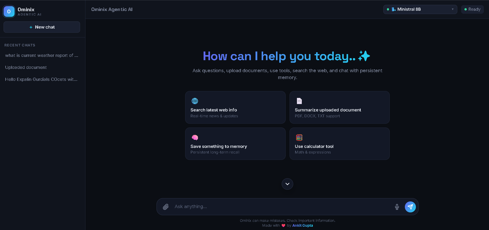

#  ***Ominix AI ✨***

### ***Intelligent Agentic AI Assistant powered by LangGraph, Groq & Streamlit***

--- 

### ***📸 Preview***

  

> 🌐 **Live Demo:** [Ominix-AI](https://ominix-ai.onrender.com)

---

### ***📖 About***

- **Ominix AI** is a modern **Agentic AI Assistant** that combines conversational AI, web search, document understanding, persistent memory, and intelligent tools into one unified workspace.

- Designed using **LangGraph**, **LangChain**, **Groq LLMs**, and **Streamlit**, it delivers fast, context-aware, and interactive AI experiences through a clean and responsive interface.

---

###  ***Features*** 

#### 🤖 AI Chat
- Multi-turn conversations
- Streaming AI responses
- Context-aware conversations
- Multiple LLM support

#### 🌐 Web Search
- Search latest information
- Real-time news
- Source-based answers

#### 📄 Document Intelligence
- Upload PDF
- Upload DOCX
- Upload TXT
- AI-powered summarization
- Ask questions from uploaded documents

#### 🧠 Persistent Memory
- Save important information
- Long-term memory
- Personalized conversations

#### 🧮 Built-in AI Tools

- Calculator
- Web Search
- Memory Tool
- Document Tool

#### 💻 Modern UI

- Beautiful Dark Theme
- Responsive Layout
- Chat History
- Modern Dashboard
- Clean User Experience

---

### 🏗️ Tech Stack
- ***Frontend: HTML | CSS | JavaScript*** 
- ***Backend: Python | LangChain | LanGraph***
- ***LLM: Groq | Mistralai | Geimini***
- ***Deployment: Render & Docker***

### AI Tools
- Tavily Search
- Calculator Tool
- Persistent Memory
- Document Processing

---

###  ***Use Cases 🎯***
- AI Assistant
- Research Assistant
- Document Summarizer
- Web Search Assistant
- Personal Knowledge Assistant
- Productivity Workspace

---
### ***🔮 Future Enhancements***
- Voice Chat
- Image Understanding
- RAG Knowledge Base
- Multi-Agent Collaboration
- Authentication
- Chat Export
- Cloud Memory Sync
- Plugin Support

---

### 👨‍💻 Developer

**Ankit Gupta 👨‍💻**

AI/ML Engineer | GenAI | Agentic AI | LangGraph

---

### ⭐ Support

- If you found this project helpful, consider giving it a **⭐ Star** on GitHub.

- It helps others discover the project and motivates further development.

---

### Built with ❤️ by Ankit Gupta

**Ominix AI • Agentic AI Workspace**

